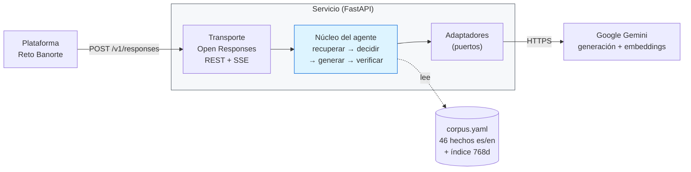
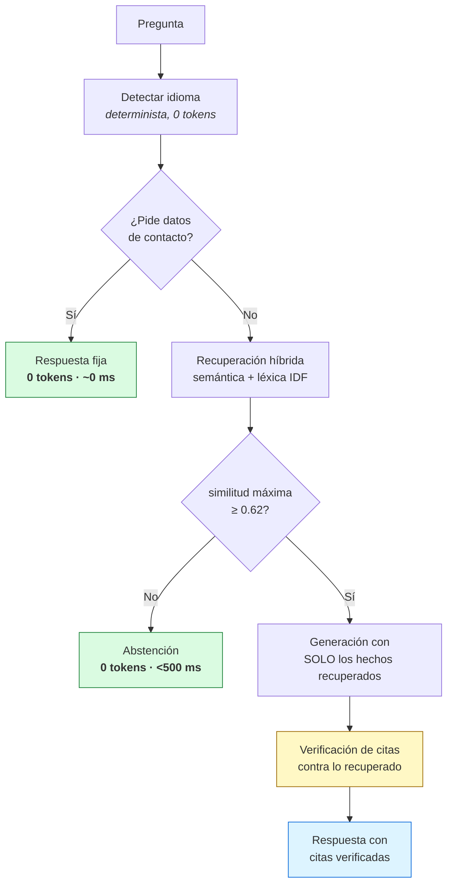

# Agente de CV — Reto IA Banorte

Agente conversacional que responde preguntas sobre la trayectoria profesional de
**Alejandro Rau Lázaro**, expuesto como servicio compatible con la especificación
abierta **[Open Responses](https://www.openresponses.org) `2026-04-24`**.

Bilingüe (español / inglés), con **grounding estricto**: el agente solo afirma lo que
puede citar, y **se abstiene sin invocar al modelo** cuando no hay evidencia suficiente.

---

## El problema que resuelve

Un agente de CV tiene un modo de fallo grave y específico: **inventar experiencia
profesional que la persona no tiene**. Una fecha, una empresa o una tecnología
fabricadas ante un reclutador no son un bug, son un problema de veracidad.

Instruir al modelo con «no inventes» es una petición, no una garantía. Este proyecto
implementa **cuatro controles independientes** que no dependen de la buena voluntad del
modelo → [ADR-003](docs/adr/ADR-003-estrategia-anti-alucinacion.md).

---

## Arquitectura



Las dependencias apuntan **hacia adentro**: el núcleo no conoce ni HTTP ni el proveedor
de LLM. Por eso se puede probar sin levantar servidor y migrar de nube o de modelo sin
tocar la lógica.

| Capa | Responsabilidad | No sabe nada de… |
|---|---|---|
| **Transporte** (`app/api/`) | Contrato Open Responses, auth, SSE, errores | CVs, Gemini |
| **Núcleo** (`app/core/`) | Recuperación, grounding, abstención, citas | HTTP, proveedores |
| **Adaptadores** (`app/adapters/`) | Gemini tras interfaces `LLM` y `Embedder` | Lógica de negocio |
| **Corpus** (`data/`) | Hechos versionados con `id` estable | — |

---

## Cómo se evitan las alucinaciones



1. **Grounding cerrado** — el prompt contiene únicamente hechos del corpus.
2. **Compuerta de evidencia** — sin evidencia no se llama al LLM. *Un modelo que no se
   invoca no puede alucinar.* Umbral **0.62**, calibrado empíricamente.
3. **Verificación de citas** — toda cita `[id]` se contrasta contra lo recuperado; las
   inventadas se eliminan. Una cita no verificable es peor que ninguna.
4. **Política de contacto determinista** — sin LLM y sin recuperación
   ([ADR-006](docs/adr/ADR-006-privacidad-y-datos-de-contacto.md)).

### Calibración del umbral

| Conjunto | n | mínimo | máximo |
|---|---|---|---|
| Preguntas **en dominio** | 8 | **0.6633** | 0.7962 |
| Preguntas **fuera de dominio** | 7 | 0.5228 | **0.5899** |

Separación limpia de +0.073. Umbral **0.62**, deliberadamente por debajo del punto medio:
abstenerse ante una pregunta legítima cuesta más que responder una fuera de dominio.

---

## Consumo de tokens

**El control anti-alucinación y el ahorro de tokens son el mismo mecanismo.**

| Medición | Resultado |
|---|---|
| Preguntas que **no** llegan al LLM | **4 de 8** del conjunto de prueba |
| Reducción de consumo total | **−54 %** (4.966 → 2.279 tokens) |
| Tokens de razonamiento eliminados | **−77 %** vía `thinkingLevel: minimal` |
| Coste de una abstención | **0 tokens**, 236–494 ms |

Palancas aplicadas → [ADR-005](docs/adr/ADR-005-consumo-de-tokens-y-latencia.md):

- Abstención previa a la invocación del modelo.
- Recuperación selectiva en lugar del CV completo en contexto.
- Razonamiento interno desactivado.
- Embeddings precalculados en *build*, no en *runtime*.
- Detección de idioma determinista, sin llamada al modelo.

El campo `usage` es **obligatorio** en el contrato Open Responses, de modo que la
medición de coste no es un añadido: es un requisito que se aprovecha como observabilidad.

---

## Uso

```bash
curl -X POST "$BASE_URL/v1/responses" \
  -H "Authorization: Bearer $AGENT_API_KEY" \
  -H "Content-Type: application/json" \
  -d '{"model":"cv-agent","input":"¿Qué experiencia tiene con IA?"}'
```

Streaming SSE con `"stream": true`. Health check en `GET /health`.

La respuesta incluye trazabilidad en `metadata`: idioma detectado, si hubo grounding,
identificadores citados, similitudes de los hechos recuperados y latencia.

---

## Desarrollo

```bash
python3 -m venv .venv && ./.venv/bin/pip install -r requirements.txt
cp .env.example .env          # rellenar GEMINI_API_KEY y AGENT_API_KEY
./.venv/bin/python scripts/build_index.py     # embeddings del corpus
./.venv/bin/uvicorn app.main:app --reload
./.venv/bin/python -m pytest -q               # 23 tests, sin red
```

Los tests **no requieren credenciales ni conexión**: el proveedor se sustituye por un
doble. El CI verifica además los 31 campos obligatorios contra el OpenAPI oficial y la
ausencia de datos de contacto en el corpus.

---

## Decisiones técnicas

| ADR | Decisión |
|---|---|
| [001](docs/adr/ADR-001-contrato-open-responses.md) | Adopción de Open Responses `2026-04-24`; el contrato es **asimétrico** |
| [002](docs/adr/ADR-002-corpus-estructurado-bilingue.md) | El CV como corpus estructurado bilingüe, no como documento |
| [003](docs/adr/ADR-003-estrategia-anti-alucinacion.md) | Cuatro controles anti-alucinación en capas |
| [004](docs/adr/ADR-004-recuperacion-sin-base-vectorial.md) | Recuperación híbrida en proceso, **sin base vectorial externa** |
| [005](docs/adr/ADR-005-consumo-de-tokens-y-latencia.md) | Consumo de tokens y latencia |
| [006](docs/adr/ADR-006-privacidad-y-datos-de-contacto.md) | Exclusión de datos de contacto |

### Dos decisiones que suelen sorprender

**No se usa base vectorial.** 46 hechos × 2 idiomas = 92 vectores. Qdrant o pgvector
añadirían infraestructura, latencia de red y un punto de fallo sin ganancia medible.
La recuperación va detrás de una interfaz, de modo que sustituirla es cambiar una clase.
*Saber cuándo no usar una tecnología es parte del criterio técnico.*

**El streaming emite texto ya verificado, no tokens crudos del modelo.** La verificación
de citas necesita el texto completo; retransmitir tokens en directo significaría emitir
contenido sin verificar. Grounding estricto y streaming crudo son incompatibles, y aquí
se elige la veracidad.

---

## Supuestos no confirmados

La plataforma del reto no documenta ciertos detalles de integración, y el agente Guía
oficial confirmó no disponer de ellos. Se mitigan por diseño en lugar de asumirlos
([ADR-001](docs/adr/ADR-001-contrato-open-responses.md)):

| Supuesto | Mitigación |
|---|---|
| Versión de la spec que consume el cliente | Se emiten los 31 campos; un cliente antiguo ignora los desconocidos |
| Formato de autenticación | Se aceptan `Authorization: Bearer`, `x-api-key` y `api-key` |
| Presencia y valor de `model` | Valor por defecto; se hace eco del recibido |
| Forma del multi-turno | `input` admite texto, array e items; se toma el último mensaje de usuario |

---

## Alcance

**Implementado:** `POST /v1/responses` no-streaming y SSE, autenticación, errores
tipados, recuperación bilingüe, abstención, verificación de citas, trazabilidad, tests, CI.

**Fuera de alcance por plazo:** transporte WebSocket, `/responses/compact`, tool calling,
entrada de imágenes. Ninguno es requisito del reto.

**Backlog de producto:** [voz bidireccional y generador conversacional de
CV](docs/BACKLOG-VALOR-AGREGADO.md) — ambos encajan en la arquitectura actual sin
rediseño.
