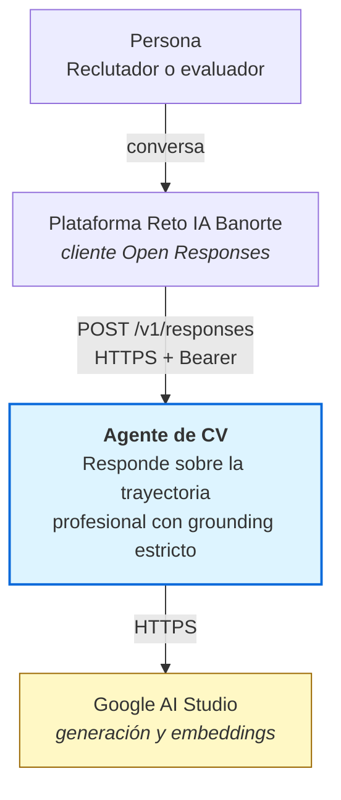
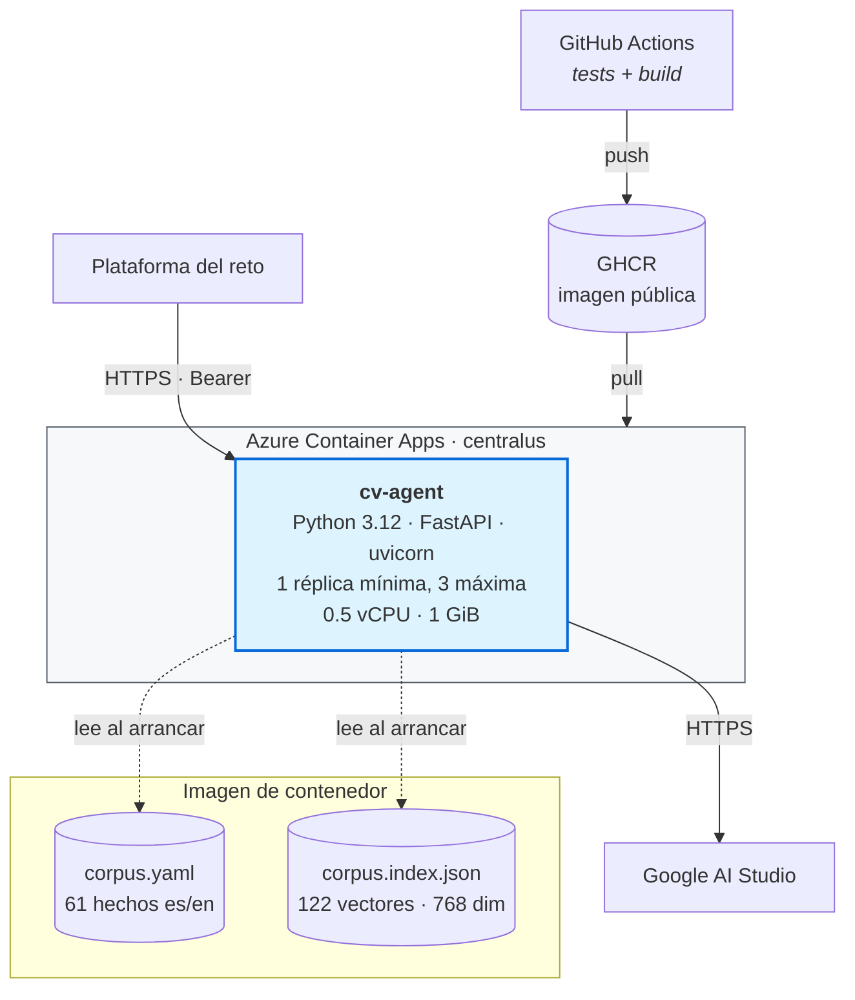
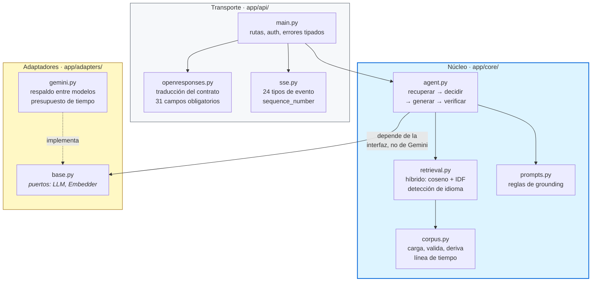
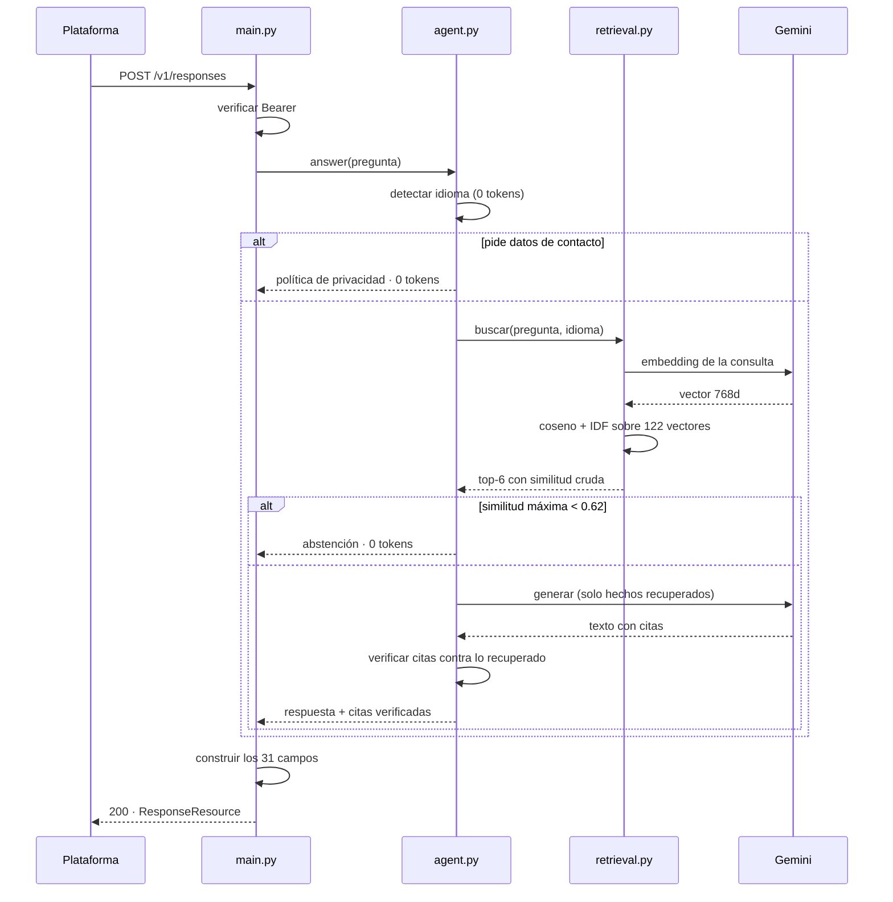
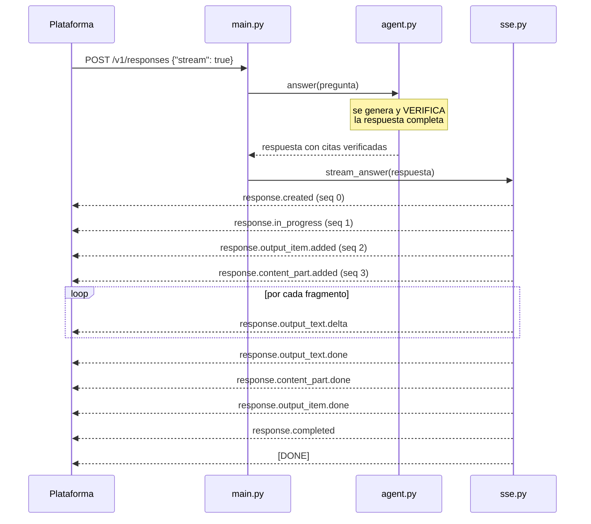
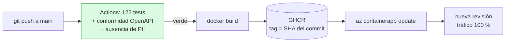

# Arquitectura

Modelo C4: se recorre el sistema en tres niveles de zoom, de fuera hacia dentro.
Los diagramas están escritos en Mermaid dentro del propio Markdown — viven en git, se
revisan en el diff y no pueden desactualizarse respecto a la documentación.

---

## Nivel 1 — Contexto

Quién usa el sistema y con qué sistemas externos habla.

**Frontera del sistema:** solo el bloque azul es nuestro. La interfaz conversacional la
pone la plataforma del reto; el modelo lo pone Google. Nuestra responsabilidad es el
servicio intermedio y la veracidad de lo que responde.

---

## Nivel 2 — Contenedores

Unidades desplegables y cómo se comunican.

Decisiones visibles en este nivel:

- **Corpus e índice viajan dentro de la imagen.** El contenedor arranca sin llamar a
  ningún servicio externo: elimina dependencias en el arranque en frío (ADR-004).
- **Sin base de datos.** El estado es de solo lectura y cabe en memoria (ADR-004).
- **La imagen se construye en GitHub Actions**, no en Azure: ACR Tasks está bloqueado
  en suscripciones nuevas (ADR-007).
- **Réplica mínima 1** para evitar arranque en frío durante la evaluación, dado que el
  timeout del cliente no está documentado.

---

## Nivel 3 — Componentes

Interior del servicio. **Las dependencias apuntan hacia adentro**: el núcleo no conoce
ni HTTP ni el proveedor de LLM.

| Capa | Responsabilidad | Desconoce |
|---|---|---|
| **Transporte** | Contrato Open Responses, autenticación, SSE, errores | Qué es un CV; qué modelo se usa |
| **Núcleo** | Recuperación, grounding, abstención, verificación de citas | HTTP, proveedores, formatos de transporte |
| **Adaptadores** | Implementan los puertos `LLM` y `Embedder` | Lógica de negocio |

**Por qué importa esta separación**, en términos concretos y verificables:

- El núcleo se prueba **sin levantar servidor y sin red**: 122 tests en 0,3 s.
- Migrar a Azure OpenAI es implementar dos métodos y cambiar una variable de entorno.
  No se toca una línea del núcleo.
- Cambiar el transporte (WebSocket, gRPC, una cola) no afecta a la lógica del agente.

---

## Flujo de una petición

Las dos ramas cortas —contacto y abstención— **no llegan al modelo**: cuestan cero
tokens y responden en menos de medio segundo. Cubren el 25 % del golden set.

---

## Flujo de streaming

**Se emite texto ya verificado, no los tokens crudos del modelo.** La verificación de
citas necesita el texto completo; retransmitir en directo significaría emitir contenido
sin verificar, y una cita inventada llegaría al usuario antes de poder eliminarla.
Grounding estricto y streaming crudo son incompatibles: se elige la veracidad, y se
asume el coste de que el primer carácter tarde más.

---

## Despliegue

La imagen se referencia por **SHA del commit**, no por `latest`: cada revisión desplegada
es trazable hasta el código exacto que la originó, y una reversión es reactivar la
revisión anterior.

---

## Referencias

| Documento | Contenido |
|---|---|
| [ADR-001](adr/ADR-001-contrato-open-responses.md) | Contrato Open Responses y su asimetría |
| [ADR-003](adr/ADR-003-estrategia-anti-alucinacion.md) | Los cuatro controles anti-alucinación |
| [ADR-004](adr/ADR-004-recuperacion-sin-base-vectorial.md) | Por qué no hay base vectorial |
| [ADR-008](adr/ADR-008-consultas-de-agregacion.md) | Consultas de agregación con metadatos |
| [RAG.md](RAG.md) | El pipeline de recuperación en detalle |
| [RUNBOOK.md](RUNBOOK.md) | Operación y diagnóstico |
| [MODELO-AMENAZAS.md](MODELO-AMENAZAS.md) | STRIDE |
