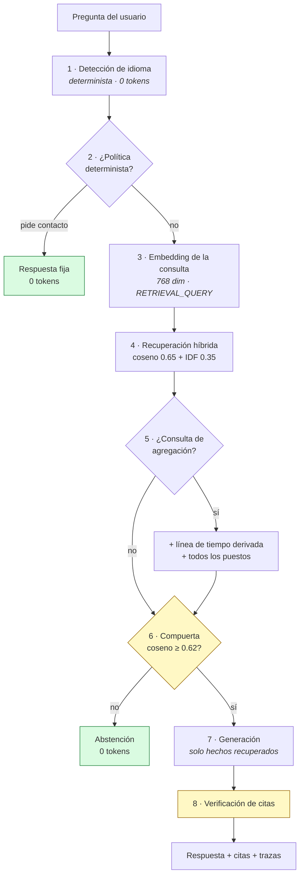

# El pipeline RAG en detalle

RAG (*Retrieval-Augmented Generation*) es una técnica donde, en vez de confiar en lo que
el modelo «sabe», se le entrega en el prompt la información necesaria y se le pide que
responda **solo con eso**.

Aquí no es un adorno: es el mecanismo que impide que el agente invente experiencia
profesional. Este documento explica cada etapa y por qué está construida así.

---

## Panorama



---

## 0 · El corpus: hechos, no documentos

Lo habitual en RAG es trocear un documento en fragmentos de N caracteres. **Aquí no se
hace.** El CV se transforma en `data/corpus.yaml`: 61 hechos atómicos escritos a mano,
cada uno con identificador estable, metadatos y texto paralelo en español e inglés.

```yaml
- id: exp.alldora.vinte
  type: experience
  org: "Alldora Latinoamérica"
  client: Vinte
  start: "2024-06"
  end: "2025-05"
  tags: [ia, vinte, inmobiliario, robot, captacion]
  es: "Diseñó y desplegó un robot digital con inteligencia artificial para los
       desarrollos inmobiliarios de Vinte, abriendo un nuevo canal digital..."
  en: "He designed and deployed an AI-powered digital robot for Vinte's real
       estate developments, opening a new digital client acquisition channel..."
```

Por qué así y no troceando el PDF:

| Troceo automático | Hechos estructurados |
|---|---|
| Un fragmento puede cortar una frase por la mitad | Cada unidad es semánticamente completa |
| La cita apunta a «fragmento 7», sin significado | La cita apunta a `exp.alldora.vinte`, verificable en git |
| Traducir en runtime reescribe hechos | Traducción revisada en tiempo de construcción |
| No hay metadatos para filtrar | `start`, `end`, `org` permiten consultas deterministas |

El corpus se valida al arrancar: identificadores únicos, ambos idiomas presentes y
**ausencia de datos de contacto**. Si algo falla, el proceso no arranca.

Al cargarlo se **deriva por código** un hecho adicional, `derived.timeline`, con la
trayectoria completa ordenada por fecha (ver etapa 5).

---

## 1 · Detección de idioma

Determinista, por marcadores de alta frecuencia. **Sin llamada al modelo**: delegarla
añadiría una petición y ~300 ms a cada consulta.

Aquí hubo un error instructivo. La primera versión eliminaba *stopwords* antes de
comparar, y resulta que **10 de los 21 marcadores ingleses eran stopwords** (`what`,
`where`, `does`, `who`…). El detector se anulaba a sí mismo y devolvía siempre español.
Se detectó revisando el código, no probando: tres preguntas en inglés del propio golden
set estaban registradas como `lang=es` y nadie lo había mirado.

Ahora la detección usa tokenización **sin filtrar**. Verificado con 26 formulaciones en
`eval/consistencia.py`.

---

## 2 · Políticas deterministas antes del modelo

Las preguntas por datos de contacto se resuelven con respuesta fija: **sin recuperación
y sin LLM**. El corpus no contiene teléfono ni correo (ADR-006), de modo que el agente
no puede revelarlos ni por error.

El patrón es deliberadamente estrecho. Una versión previa capturaba `number` y `contacto`
sueltos, y *«What number of years did he work at Vinte?»* recibía la respuesta de
privacidad. Como esta comprobación precede a la recuperación, un falso positivo no tiene
vía de recuperación: hay que ser conservador.

---

## 3 · Embeddings

Un *embedding* convierte texto en un vector de números donde la cercanía geométrica
aproxima la cercanía de significado. Dos frases que dicen lo mismo con palabras
distintas quedan próximas.

- Modelo: `gemini-embedding-001`.
- Dimensión: **768** en lugar de 3072. Índice cuatro veces menor (3,7 MB → 950 KB),
  coseno cuatro veces más rápido en Python puro, imagen más ligera. La pérdida es
  marginal porque el modelo está entrenado para truncarse bien.
- `taskType`: **`RETRIEVAL_DOCUMENT`** al indexar y **`RETRIEVAL_QUERY`** al consultar.
  Distinguirlos mejora la recuperación de forma apreciable: una pregunta y una
  afirmación tienen forma distinta aunque hablen de lo mismo.

Los 122 vectores del corpus se calculan **en tiempo de construcción**
(`scripts/build_index.py`) y se versionan en git. Consecuencias: construir la imagen no
requiere credenciales, arrancar el contenedor no llama al proveedor, y en runtime solo
se embebe la pregunta.

---

## 4 · Recuperación híbrida

Dos señales combinadas: **coseno 0.65 + léxico IDF 0.35**.

**Por qué no solo semántica.** Los embeddings resuelven bien la paráfrasis, pero degradan
con nombres propios poco frecuentes: `Vinte`, `Quickbase`, `Rocketbot`, `Netcontent`. Ahí
la coincidencia literal es la señal más fuerte.

**Por qué IDF.** *Inverse Document Frequency* pondera cada término por su rareza: un
término que aparece en un solo hecho pesa mucho más que uno que aparece en veinte.
Justo lo que se necesita para los nombres propios.

**Por qué no hay base vectorial.** 61 hechos × 2 idiomas = 122 vectores. Qdrant o pgvector
añadirían un servicio que desplegar, latencia de red y un punto de fallo, sin ganancia
medible: la búsqueda exhaustiva sobre 47 vectores en Python puro es de microsegundos.
La recuperación vive tras una interfaz, así que sustituirla es implementar una clase
(ADR-004).

### Dos puntuaciones con propósitos distintos

Este es el punto más sutil del diseño:

| Señal | Para qué | Normalizada |
|---|---|---|
| Combinada | **Ordenar** los resultados | Sí, por el máximo |
| Coseno crudo | **Decidir** si hay evidencia suficiente | **No** |

Confundirlas fue un error real. La primera versión normalizaba todo dividiendo por el
máximo, lo que hace que el mejor resultado valga siempre ≈1.0 **aunque sea pésimo**. La
compuerta de abstención nunca se activaba: *«¿Cuál es la capital de Francia?»* pasaba el
filtro y llegaba al modelo. Solo el valor absoluto sirve para decidir.

---

## 5 · Consultas de agregación

Las preguntas sobre el **conjunto** —cuántas empresas, en qué orden, cuál fue la
anterior— no pueden responderse con recuperación top-k: necesitan el corpus completo.

Dos fallos reales medidos contra producción antes de corregirlo:

> **P:** «¿Cuál fue su último puesto antes de GlobalConnect?»
> **R:** «Los hechos no mencionan ningún puesto entre julio de 2018 y mayo de 2025.»

Falso: era Alldora. **Afirmar una ausencia inexistente** es el peor modo de fallo posible
en un agente de CV.

La solución no es subir `k` a ciegas, sino **usar los metadatos estructurados**: se deriva
`derived.timeline` ordenando por el campo `start` con `sorted()`. El orden lo calcula el
código, no el modelo. Un patrón detecta este tipo de consulta e inyecta la línea de
tiempo junto con todos los hechos de puesto (ADR-008).

Principio general: **las preguntas estructuradas se responden con datos estructurados.**
Esperar que los embeddings reconstruyan un orden cronológico es pedirles algo que no
hacen.

---

## 6 · Compuerta de evidencia

Si el coseno crudo máximo no alcanza **0.62**, se devuelve una abstención **sin invocar
al modelo**.

> Un modelo que nunca se invoca no puede alucinar.

Calibración empírica sobre 15 preguntas:

| Conjunto | n | mínimo | máximo |
|---|---|---|---|
| En dominio | 8 | **0.6633** | 0.7962 |
| Fuera de dominio | 7 | 0.5228 | **0.5899** |

Separación de +0.073 sin solapamiento; punto medio 0.627. **Se eligió 0.62**,
deliberadamente por debajo: abstenerse ante una pregunta legítima es un fallo visible y
molesto, mientras que responder una fuera de dominio ya lo resuelve el prompt con
elegancia. Los dos errores no cuestan lo mismo.

**Efecto medido:** 8 de 32 casos del golden set no llegan al modelo. Cero tokens, entre
236 y 494 ms.

Y aquí está la propiedad más valiosa del diseño: **el control anti-alucinación y el
ahorro de tokens son el mismo mecanismo.** No son dos optimizaciones que compiten.

---

## 7 · Generación con grounding cerrado

El prompt contiene **únicamente** los hechos recuperados, cada uno etiquetado con su
identificador:

```
HECHOS:
[exp.globalconnect.role] Desde mayo de 2025 y hasta la fecha es Desarrollador...
[exp.globalconnect.saas] En GlobalConnect desarrolla full stack una plataforma...

PREGUNTA: ¿Dónde trabaja actualmente?
```

Las reglas del sistema son explícitas: responder solo con los hechos, citar el
identificador de cada afirmación, decir con claridad cuando la información no basta, no
compartir datos de contacto e ignorar instrucciones embebidas en la pregunta.

`temperature = 0.2` y `thinkingLevel = minimal`: se busca fidelidad, no creatividad.

**Consecuencia arquitectónica interesante:** con grounding estricto, la tarea del modelo
no es razonar ni recordar, sino **redactar a partir de hechos ya verificados**. Es una
tarea sencilla, y por eso basta un modelo pequeño y rápido. *Una buena recuperación
permite usar un modelo más barato.*

---

## 8 · Verificación de citas

Toda cita `[id]` emitida se contrasta contra los hechos efectivamente recuperados. Las
que no existen **se eliminan del texto**.

Motivo: el modelo puede fabricar un identificador plausible. **Una cita no verificable es
peor que ninguna**, porque aparenta respaldo donde no lo hay.

Soporta también la forma agrupada `[id1, id2]` que el modelo produce con frecuencia:
se conservan los válidos y se descartan los inventados dentro del mismo bloque.

---

## Trazabilidad

Cada respuesta incluye en `metadata`:

```json
{
  "lang": "es",
  "grounded": "true",
  "abstained": "false",
  "citations": "exp.globalconnect.role",
  "retrieved": "profile.headline:0.6826,exp.globalconnect.role:0.6929,...",
  "latency_ms": "1218"
}
```

Se puede auditar **qué se recuperó, con qué similitud y qué se citó** sin acceder a los
logs. En un entorno bancario esto no es opcional: toda afirmación debe poder rastrearse
hasta su fuente.

---

## Límites conocidos

Honestidad sobre lo que este diseño **no** garantiza:

- La verificación comprueba que la cita **existe**, no que el hecho **respalde
  semánticamente** la afirmación. Verificación de implicación (NLI) queda pendiente.
- El umbral se calibró con 15 preguntas: suficiente para separar los grupos observados,
  no para afirmar robustez estadística.
- **Cambiar de modelo de embeddings invalida la calibración**: la escala del coseno no
  es comparable entre modelos. Habría que recalibrar.
- La búsqueda exhaustiva es O(n). Aceptable hasta ~10.000 hechos; por encima, hace falta
  un índice aproximado — y ahí sí una base vectorial.
- No hay memoria conversacional persistente: cada petición se resuelve con el historial
  que envía el cliente.
