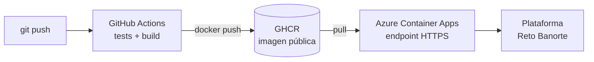

# ADR-007 — Despliegue en Azure con construcción de imagen en GitHub Actions

- **Estado:** Aceptado
- **Fecha:** 2026-08-22

## Contexto

El reto exige **desplegar** el agente en un endpoint público. No impone proveedor:
«No existe una única arquitectura correcta».

Se eligió **Azure Container Apps** por alineamiento explícito con el entorno destino:
la vacante de la Dirección de IA e Innovación de Banorte menciona «soluciones
end-to-end desplegables Azure» y «despliegue en nube (Azure y Google Cloud)».

## Restricción encontrada

El plan inicial era `az containerapp up --source .`, que delega la construcción de la
imagen a **ACR Tasks** (servicio de build gestionado de Azure), evitando necesitar
Docker en la máquina local.

Azure lo rechazó:

```
ERROR: (TasksOperationsNotAllowed) ACR Tasks requests for the registry
cad1f8534e1dacr and 79394b14-... are not permitted.
Please file an Azure support request at http://aka.ms/azuresupport
```

**ACR Tasks está bloqueado por defecto en suscripciones nuevas** como medida antifraude
de Microsoft. Desbloquearlo requiere un ticket de soporte, con tiempos de respuesta
incompatibles con el plazo de entrega.

Precisión relevante: **no** es un problema de cuota, crédito ni de recursos agotados. Es
una restricción de política sobre la suscripción.

## Alternativas evaluadas

| Opción | Valoración |
|---|---|
| Ticket de soporte a Microsoft | Descartada: los tiempos de respuesta no caben en el plazo |
| Instalar Docker Desktop y construir en local | Viable pero costosa en tiempo, y deja la construcción atada a una máquina concreta — no reproducible |
| **Construir en GitHub Actions y publicar en GHCR** | **Elegida** |
| Cambiar de proveedor de nube | Descartada: se perdería el alineamiento con Azure sin necesidad |

## Decisión

**GitHub Actions construye la imagen y la publica en GitHub Container Registry (GHCR).
Azure Container Apps la consume desde ahí.**



## Consecuencias

### Positivas

- **La restricción produjo una arquitectura mejor.** Se pasa de una construcción manual
  y local a **entrega continua real**: `git push` dispara tests, construcción, publicación
  y despliegue. La vacante pide explícitamente familiaridad con pipelines CI/CD
  (Azure DevOps, GitHub Actions, GitLab); ahora es demostrable, no declarativo.
- **Reproducibilidad.** La imagen se construye en un entorno limpio y versionado, no en
  la máquina de un desarrollador. Cualquiera puede reconstruirla de forma idéntica.
- **Trazabilidad.** Cada imagen queda ligada al commit que la originó.
- **Se conserva el despliegue en Azure**, que era el objetivo estratégico.
- No se requiere Docker en la máquina de desarrollo.

### Negativas y riesgos aceptados

- Dependencia de un segundo proveedor (GitHub) en la cadena de despliegue. En un entorno
  productivo bancario esto exigiría revisión de la cadena de suministro de software y,
  muy probablemente, un registro privado interno.
- La imagen es **pública** en GHCR. Aceptable porque no contiene secretos: las
  credenciales se inyectan en tiempo de ejecución como secretos de Container Apps, nunca
  en la imagen.
- Mayor latencia en el primer despliegue (build remoto).

## Gestión de secretos

Las claves **no** viajan en la imagen ni en el repositorio:

- `GEMINI_API_KEY` y `AGENT_API_KEY` se registran como **secretos de Azure Container Apps**
  y se exponen al contenedor por referencia.
- `.env` está excluido del control de versiones y verificado como ignorado.
- El repositorio incluye `.env.example`, que documenta **los nombres** de las variables,
  nunca sus valores.

## Configuración de escalado

`min-replicas = 1`. Container Apps escala a cero por defecto, lo que introduce arranque
en frío. Dado que la plataforma del reto **no documenta su timeout** (ADR-001), un
arranque en frío durante la evaluación podría producir un fallo de integración.

Mantener una réplica activa elimina ese riesgo a cambio de un consumo modesto. Para uso
prolongado más allá de la evaluación, `min-replicas = 0` reduce el coste a prácticamente
cero aceptando el arranque en frío.
